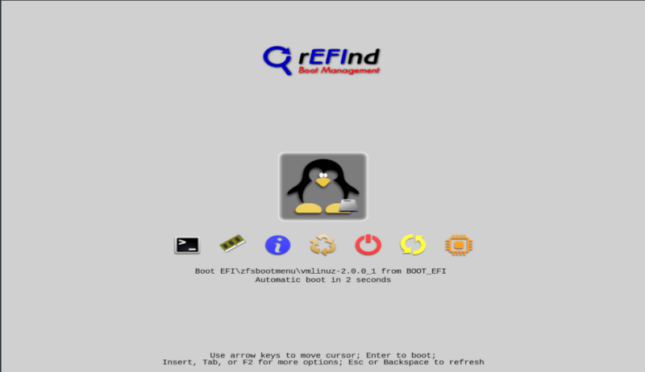

# ZFS on Root For Ubuntu 22.04 LTS

This Ansible role is my standardized ZFS on Root installation that I use as a base for all my systems.  Additional roles are applied on top of this to make the generic host a specialized Home Theater PC, Full Graphical Desktop, Kubernetes Cluster node, a headless Docker Server, etc...

_NOTE: This Ansible role is not structured as rigid as a typical Ansible role should be.  Tips and suggestions on how to improve this are welcomed._

---

Originally based on the OpenZFS 'ZFS on Root' Guide, but no longer. Now with many enhancements:

* Uses ZFSbootMenu / rEFInd / Syslinux to manage boot environments
  * rEFInd provides graphical boot loader menu and roll-back to previous kernels on UEFI systems
  * Syslinux provides boot loader menu for Legacy BIOS systems
  * ZFSbootMenu provides menu driven roll-back to previous ZFS snapshots
  * Automatic snapshot creation upon apt/dpkg install or remove
* No GRUB Boot Loader!
* All ESP (boot) partitions are `mdadm` mirror across all devices
* No separation of `bpool` and `rpool` just a single `rpool` is needed
* Predefine rules for ZFS `rpool` pools types (mirror, raidz1, raidz2, multiple mirror vdevs) based on number of devices available
* Swap partitions can be enabled
  * Multi-disk swap partitions automatically setup with `mdadm`
  * If encryption is enabled, LUKS is used to encrypt Swap partitions
* Native ZFS Encryption Support
* UEFI and Legacy Booting supported (can even switch between them)
* Multiple non-root user account creation (each user gets own ZFS dataset)
* Customized SSH Configuration Options
* DropBear support for unlocking ZFS encrypted pool remotely
* Support for Apt-Cacher-NG proxy for cached packages

---

## TL;DR

* While this is a WORK IN PROGRESS, I've built many systems using various combinations.
  * However not every combination has been tested.  If you find a problem, please open a Github issue in this repository.
  * Review [known issues](README.md#known-issues) for workarounds.

* This Ansible based process is intended to be used against bare-metal systems or virtual machines (just needs SSH access to get started).
  * This is intended for initial installation ONLY, this is not for applying changes over time -- you should make those changes via some other playbook / change control system.
* This process uses ENTIRE disk(s) and wipes partitions on the specified disks, any existing data on these partitions on the target system will be lost.
* Review the `defaults/main.yml` to set temporary passwords,  non-root user account(s) and basic rules on boot partition sizes, swap partitions, etc.
* Defaults to building a headless server environment, however a full graphical desktop can be enabled.

---

## Environments Tested

* Ubuntu 22.04.1 Live CD Boot on Bare Metal or within VirtualBox

---

## Requirements

* [Ansible](https://www.ansible.com/) (Built with Ansible Core 2.12 or newer)
* [Ubuntu 22.04.1 "Jammy" Live CD](https://ubuntu.com/download/desktop/) (22.04 LTS Desktop - DO NOT use server images)
  * _NOTE: you can configure for command-line only server build even when using the desktop image._
* Computers that have less than 2 GiB of memory run ZFS slowly. 4 GiB of memory is recommended for normal performance in basic workloads.

## Caution

* This process uses the whole physical disk
* This process is not compatible with dual-booting
* Backup your data. **Any existing data will be lost!**

---

## What is rEFInd and ZFSbootMenu?

**rEFInd** is a graphical boot manager replacement used instead of GRUB.  GRUB is not ZFS aware.



* Can be themed and customized as well!

**ZFSbootManager** allows you to select which "boot environment" to use, this can be a previous ZFS Snapshot. See [Project Home Page](https://github.com/zbm-dev/zfsbootmenu) for details.


* Can browses, clone and promote ZFS snapshots to new boot environments.
* Snapshots will automatically be taken before each `apt` or `dpkg` update.

---

## WHY use THIS instead of Ubuntu's Installation Wizard

My intention for this to have a standardized and repeatable base install for my occasional one off builds.  However being based on Ansible this can be used to make batches of servers or desktops needing ZFS on Root installations.

### Configurable Rules

This provides a configurable way to define how the ZFS installation will look like and allows for topologies that cannot be defined within the standard Ubuntu installation wizard.  

* For example:
  * If you always want a 3 disk setup to be a _raidz_ root pool, but a 4 disk setup should use multiple _mirrored_ vdev based root pool you can define these defaults.
* The size of swap partitions can be defined to a standard value for single device and mirrored setups or a different value for raidz setup.
* UEFI Booting is automatically enabled and will be used when detected, it will fall back to Legacy BIOS booting when not detected.
* The installation is configurable to be a command-line only (server build) or Full Graphical Desktop installation.

### Optional ZFS Native Encryption

[ZFS Native Encryption](docs/zfs-encryption-settings.md) (aes-256-gcm) can be enabled for the root pool. If create swap partition option is enabled, then the swap partition will also be encrypted. From the [OpenZFS overview](https://openzfs.github.io/openzfs-docs/Getting%20Started/Ubuntu/Ubuntu%2020.04%20Root%20on%20ZFS.html#encryption):

* ZFS native encryption encrypts the data and _most_ metadata in the root pool. It does not encrypt dataset names, snapshot names or properties.
* The system cannot boot without the passphrase being entered at the console. [Dropbear](docs/dropbear-settings.md) support can be enabled to allow remote SSH access at boot to enter passphrase remotely.

### SSHD Configuration Settings

Some of the [SSHD configuration](docs/custom-sshd-settings.md) options can be defined to help lock down your base server image. For example, Password Authentication will be disabled, Pubkey Authentication will be enabled, Root login will only be permitted via PubKey Authentication.

### Dropbear Support

When a computer is rebooted with ZFS native encryption enabled then someone needs to be at the console to enter the passphrase for the root pool encryption.  

* You can enable the option to install [Dropbear](https://en.wikipedia.org/wiki/Dropbear_(software)) to provide a lightweight SSH process as part of the initramfs during the boot process.  
* This allows you to remotely SSH to the console to provide the root pool passphrase to allow the machine to continue to boot.  
* Dropbear will default to port 222.
* RSA, ECDSA, or ED25519 keys can be used to connect to Dropbear (no passwords allowed)

---

## How do I set it up

### Edit your inventory document

I use a `yaml` format inventory file, you will have to adjust to whatever format you use.

```yaml

---
###[ Define all Hosts ]########################################################
all:
  hosts:
    ...

  children:
    ###[ ZFS on Root Installs ]################################################
    zfs_on_root_install_group:
      hosts:
        testlinux01.localdomain:
          host_name: "testlinux01"
          disk_devices: ["sda", "sdb", "sdc"]

        testlinux02.localdomain:
          host_name: "testlinux02"
          disk_devices: ["sda", "nvme0n1"]

        testlinux03.localdomain:
          host_name: "testlinux03"
          disk_devices: ["sda"]
          root_partition_size: "120G"

      vars:
        # Define the default domain these hosts will use
        domain_name: "localdomain"

        # Define URL for Apt-Cacher-NG Package Cache
        # apt_http_proxy: "http://192.168.0.243:3142"
        # apt_https_proxy: false
```

* `zfs_on_root_install_group:` block lists the hostname(s) that you intend to boot the Live CD on and perform a ZFS on Root installation.

#### Inventory / Host Variables

All of these are optional, if not provided you will be prompted to enter values if needed.

* `host_name:` defines the name of the new system to be built, if set here you will not be prompted for it.
* `disk_device:` defines the name of the disk devices to use when building the ZFS pools if you know them in advance.  
  * This makes reinstalls easier. Define unique configurations when needed.
  * When this is set you will not be prompted.
  * Default rules will make 2 devices a mirror, 3 will use a raidz1, 4 will join two mirrored vdevs into a pool (you can redefine these)
* `root_partition_size:` allows you to specify the partition size to be used for the root pool.  
  * This is per disk device partition size (not a specification of overall pool size)
  * By default it will allocate all remaining disk space (implies `0` [zero])
  * You can specify a specific size (positive number) such as `120G` or `+120G`
  * Or state how much space not to use (negative number) such as `-512M`
* `domain_name:` under `vars:` sets the domain name that will be used for each host created.  If an individual host needs a different domain name then just add a `domain_name:` under that host.
* `apt_http_proxy` and `apt_https_proxy` can be used to specify where to find Apt-Cacher-NG instance available on your network
  * Apt-Cacher-NG will cache downloaded `apt` packages reducing your internet bandwidth needs for packages

---

### Edit `defaults/main.yml` to define the defaults

The `defaults/main.yml` contains most setting that can be changed.  

You are  defining reasonable defaults.  Individual hosts that need something a little different can be set in the inventory file or you can use any other method that Ansible support for defining variables.

#### Disable Logging Secrets

Ansible tasks that reference secrets (password or passphrase) may show them on the screen as well as settings summary screens.  Showing passwords can be enabled if that would help troubleshooting.

```yml
# Don't log secret like ZFS on Root Password when running playbook
no_log_secrets: true
```

#### Define Temporary Root Password

This temporary root password is only used during the build process.  The ability for root to use a password will be disabled towards the final stages.

```yml
###############################################################################
# User Settings
###############################################################################

# This is a temporary root password used during the build process.  
# Root password will be disabled during the final stages.
# The non-root user account will have sudo privileges
default_root_password: "change!me"
```

#### Define the Non-Root Account(s)

 Define your standard privileged account(s).  The root account password will be disabled at the end, the privileged account(s) defined here must have `sudo` privilege to perform root activities. You will be forced to change this password upon first login. (Additional accounts can be defined).

NOTE: The `~/.ssh/authorized_keys` for the 1st user will be allowed to connect to Dropbear (if enabled)

```yaml
# Define non-root user account(s) to create (home drives will be its own dataset)
# Each user will be required to change password upon first login
regular_user_accounts: 
  - user_id: "rich"
    password: "change!me"
    full_name: "Richard Durso"
    groups: "adm,cdrom,dip,lpadmin,lxd,plugdev,sambashare,sudo"
    shell: "/bin/bash"
```

### Additional Settings to Review

* Review [Computer Configuration Settings](docs/computer-config-settings.md)
* Review [SWAP Partition Settings](docs/swap-partition-settings.md)
* Review [Root Pool & Partition Settings](docs/root-partition-settings.md)
* Review [ZFS Native Encryption Settings](docs/zfs-encryption-settings.md)
* Review [Custom SSHD Configuration Settings](docs/custom-sshd-settings.md)
* Review [DropBear Settings](docs/dropbear-settings.md)
* Review [MSMTP client for SMTP Email notifications](docs/msmtp-settings.md)

### Additional Configuration Files

There should be no reason to alter the configuration file `vars/main.yml` which defines all the details and flags to construct partitions, root pools, and how all the dataset will be created.  If this type of information interests you, this is where you will find it... but don't change anything unless you understand what you are looking at.

---

## How do I Run It

### Prepare the Install Environment

1. Boot the Ubuntu Live CD:
    * Select option <button name="button">Try Ubuntu</button>.
    * Connect your system to the Internet as appropriate (e.g. join your Wi-Fi network).
    * Open a terminal within the Live CD environment - press <kbd>Ctrl</kbd> <kbd>Alt</kbd>-<kbd>T</kbd>.

2. Install and start the OpenSSH server in the Live CD environment (see helper script below):

#### Fetch Helper Script

The helper script will perform many steps for you such as update packages, create an `ansible` user account, define a password for that account, grant the `ansible` account `sudo` privileges, install SSH server, python, etc.

##### Option 1 - Proper Way to Run Helper Script

```bash
wget https://raw.githubusercontent.com/reefland/ansible-zfs_on_root/master/files/do_ssh.sh

chmod +x do_ssh.sh

./do_ssh.sh
```

* When prompted for the Ansible password, enter and confirm it.  This will be a temporary password only needed just to push the SSH Key to the target machine.  The Ansible password will be disabled and only SSH authentication will be allowed.

##### Option 2 - Lazy Way to Run Helper Script

```bash
wget -O - https://bit.ly/do_ssh | bash

sudo passwd ansible
```

* The `-O` after `wget` is a capital letter `O` (not a zero).

The Live CD Install Environment is now ready.  Nothing else you need to do here.  The rest is done from the Ansible Control node.

#### If Helper Script is not Available

* [Manual steps](docs/do_ssh_helper_script.md) if you are unable to access "do_ssh.sh" Help Script.

### Push your Ansible Public Key to the Install Environment

From the Ansible Control Node push your ansible public key to the Install Environment.
You will be prompted for the ansible password create within Ubuntu Live CD Install Environment:

```bash
ssh-copy-id -o "UserKnownHostsFile=/dev/null" -o "StrictHostKeyChecking=no" -i ~/.ssh/ansible.pub ansible@<remote_host_name>

# Expected output:
ansible@<remote_host_name> password: 

Number of key(s) added: 1

Now try logging into the machine, with:   "ssh 'ansible@<remote_host_name>'"
and check to make sure that only the key(s) you wanted were added.
```

Optionally, you can test connectivity easily to verify SSH has been configured correctly.

```bash
ansible -i inventory.yml -m ping <remote_host_name>

# Expect output to include:

remote_host_name | SUCCESS => {
    "changed": false,
    "ping": "pong"
}
```

You are now ready to perform a ZFS on Root installation to this target machine.

### Fire-up the Ansible Playbook

The most basic way to run the entire ZFS on Root process and limit to an individual host as specified:

```bash
ansible-playbook -i inventory.yml ./zfs_on_root.yml -l <remote_host_name>
```

* [Additional Examples with Playbook Variables](docs/playbook-examples.md)

After a few minutes, if all goes well you will have a reasonably decent standardized configuring to be a base system ready to be used and modified for any other specific role.

The first thing I do once this Playbook completes is apply the [Customized Message of the Day](https://github.com/reefland/ansible-motd-zfs-smartd) Ansible Playbook for a login screen with a bit of bling.

---

### Alternative Step by Step Installation

As an alternative to running the entire playbook at one time, it can be run sections at a time using the ansible `tags` as defined below.  This method can be used to troubleshoot issues and replay steps if you have a way of rolling back previous failures. Failures can be rolled back either manually or via snapshots in Virtualbox or equivalent.

To run just one step via tags, all the [Ansible Playbook examples](docs/playbook-examples.md) can be used with the addition of including `--tags`:

```bash
ansible-playbook -i inventory ./zfs_on_root.yml --extra-vars='{disk_devices: [sda, sdb], host_name: testlinux}' -l <remote_host_name> --tags="install-zfs-packages"
```

Multiple tags can be combined to run several tasks:

```text
--tags="create_pools, create_filesystems, create_datasets"
```

This is the list and order of execution for all tags defined for this playbook:

```text
    tags:
      - install-zfs-packages
      - clear_partition_tables_from_devices
      - create_partitions
      - create_pools
      - create_filesystems
      - create_datasets
      - config_system
      - install_zfs
      - config_boot_fs
      - install_dracut
      - install_refind
      - install_syslinux
      - install_zfsbootmenu
      - config_swap [not tested]
      - system_tweaks
      - first_boot_prep
      - fix_mount_order
      - unmount_chroot
      - reboot_remote
      - create_regular_users
      - copy_ssh_keys_notice
      - install_dropbear
      - final_setup
      - restart_remote_final
```

Helper tasks, basic sanity checks and mandatory tasks are already marked as `always` and will always be processed to setup the base ansible working environment reading configuration files, setting variables, etc... nothing special you need to do.

### Grouping Tags

A reasonable way to build a system in stages using a group of tags instead of calling them individually:

```text
--tags="install-zfs-packages, clear_partition_tables_from_devices, create_partitions, create_pools"
--tags="create_filesystems, create_datasets, config_system, install_zfs"
--tags="config_boot_fs, install_dracut, install_refind, install_syslinux"
--tags="install_zfsbootmenu, config_swap, system_tweaks, first_boot_prep"
--tags="fix_mount_order, unmount_chroot, reboot_remote"
--tags="create_regular_users, copy_ssh_keys_notice, install_dropbear, final_setup, restart_remote_final"
```

### Skipping Tags

Specific tags can also be skipped.  For example, if you do not wish to see the manual confirmation page each time; and would rather the playbook just execute directly. Then use:

```text
--skip-tags="confirm_defaults"
```

---

## Known Issues

* Nothing happens after 1st reboot? See if [UEFI BIOS Bugs / Glitches / Issues](./docs/uefi-bugs-issues.md) helps.
* `mdadm` error [super1.x cannot open / Device or resource busy](./docs/mdadm-error-cannot-open.md) during `config_boot_fs` tag processing

---

## More about Root Pool using Mirrored vdev Process

This topology is not available from Ubuntu installer and is not covered by the [OpenZFS HowTo method](https://openzfs.github.io/openzfs-docs/Getting%20Started/Ubuntu/Ubuntu%2020.04%20Root%20on%20ZFS.html#overview).

Here is a brief [overview with additional information](docs/root-pools-multi-mirrored-vdevs.md).

---

## Helper Scripts

* [do_ssh.sh](docs/do_ssh_helper_script.md) - Makes a LiveCD environment accessible to Ansible via SSH.
* TODO: NOT UPDATED YET - for 20.04 still: [partition_drive_helper.sh](docs/partition_drive_helper_script.md) - documents disk partitions values used and will help you go from a blank replacement device to a fully repaired system.

---

## Emergency chroot Recovery

If your system is unable to boot, then boot from the Ubuntu Live CD to create a `chroot` environment where you can decrypt and mount your ZFS pools, mount boot partitions and have an interactive shell to inspect, troubleshoot, apply updates, etc.  You should be comfortable with [Emergency chroot Recovery](./docs/chroot-recovery.md) process.

---

### Marking Swap Device as Failed

NOTE: `mdadm` is used to create mirrored or striped swap partitions.  If you will be replacing a drive then you should mark the device as **failed** before removing it from the system. Failure to do so will likely result in no swap being available.  Marking the device as failed before removal allows the swap device to function even if in a degraded state.

* [Detailed mdam steps to review](docs/mark_swap_device_as_failed.md) to mark as failed.
* Includes steps on rebuilding all partitions and replacing a completely failed drive.
